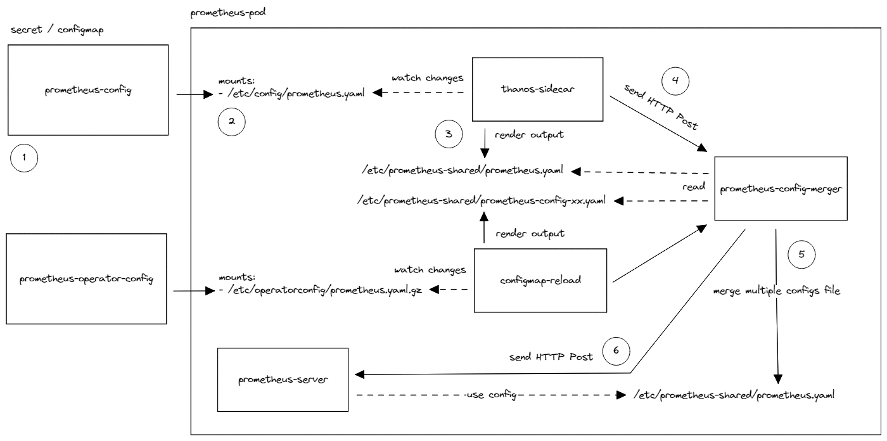

# Prometheus Config Merger

Prometheus Config Merger is a utility that allows you to merge multiple Prometheus configuration files into one and write it to a designated location. It also provides a way to automatically notify Prometheus-Server of any changes in the configuration file. This utility can be used in combination with Prometheus-Operator to segregate Prometheus-related configurations without needing to migrate your current monitoring stack to use Prometheus-Server by Prometheus-Operator.

Let's say we have 2 Prometheus configuration files

*prometheus_current.yaml*
```
global:
  evaluation_interval: 1m
  scrape_interval: 15s
rule_files:
  - /etc/config/recording_rules.yml
  - /etc/config/alerting_rules.yml
scrape_configs:
  - job_name: prometheus
    ...
...
```

*prometheus_operator.yaml*
```
global:
  evaluation_interval: 30s
  scrape_interval: 30s
rule_files:
  - /etc/prometheus/rules/prometheus-k8s-rulefiles-0/*.yaml
scrape_configs:
  - job_name: serviceMonitor/default/fluentd/0
    ...
...
```

For some reason, we need the `prometheus-server` to be able to read those 2 configuration files at same time (for **rule_files** and **scrape_configs** fields only). So, basically we need to have those Prometheus configuration files to be merged, to let Prometheus-Server use it as it's configuration file.

## Getting Started

1. Clone the repository to your local machine using `git clone https://github.com/kmdrn7/prometheus-config-merger.git`
2. The prerequisites for this utility is go version 1.15 or above, please make sure you have it installed in your system.
3. To build the binary, run make build
4. Once built, you can use the binary to merge your Prometheus configuration files.

To be able to merge those configuration files, run this command
```
prometheus-config-merger merge
```

If you want to run merge command based on Http POST request trigger on `/-/reload`, run this command
```
prometheus-config-merger server
```

***NOTE: please configure the parameters accordingly***

After running the command, it will create a new `prometheus.yaml` file where the merged configuration file is stored

*prometheus.yaml*
```
global:
  evaluation_interval: 1m
  scrape_interval: 15s
rule_files:
  - /etc/config/recording_rules.yml
  - /etc/config/alerting_rules.yml
  - /etc/prometheus/rules/prometheus-k8s-rulefiles-0/*.yaml
scrape_configs:
  - job_name: prometheus
    ...
  - job_name: serviceMonitor/default/fluentd/0
    ...
...
```

You can observe the values of **rule_files** and **scrape_configs** in new Prometheus configuration file is taken from those 2 segregated Prometheus configuration files `prometheus_current.yaml` and `prometheus_operator.yaml`

PS: It only merge the **rule_files** and **scrape_configs** fields from multiple Prometheus configuration files, and using one of them as base config. This behavior is configurable through `prometheus-config-merger.yaml`

## Example Usage

I want to merge the Prometheus-Operator config file with my current Prometheus-Server deployment, so my current Prometheus-Server will be able to use Prometheus-Operator's ability to segregate prometheus related configurations without needing to migrate current monitoring stack to use Prometheus-Server provided by Prometheus-Operator (through it's CRD) *.

## Example Usage Overview

1. Prepare the configuration file for merging.
2. Mount the configuration file into the Prometheus-Server pod.
3. Add sidecar containers to read and process the Prometheus configuration file, including extracting it from a .gz file or expanding environment variables within the file.
4. Update the sidecar containers (config-reloader) args so that it can notify the prometheus-config-merger of any changes.
5. The prometheus-config-merger will combine multiple Prometheus configuration files into one and write it to designated location.
6. Notify the Prometheus-Server for any changes in the configuration file.

**(prometheus-server deployed on kubernetes)*

## Contributions
We welcome contributions to the Prometheus Config Merger, please follow the guidelines for submitting pull requests and reporting bugs.

## License
Prometheus Config Merger is open-sourced software licensed under the MIT license.

## Additional notes
Feel free to open an issue if you have any questions or problems.

The code was originally forked from https://github.com/coreos/prometheus-config-reloader and adapted to merge multiple config files.